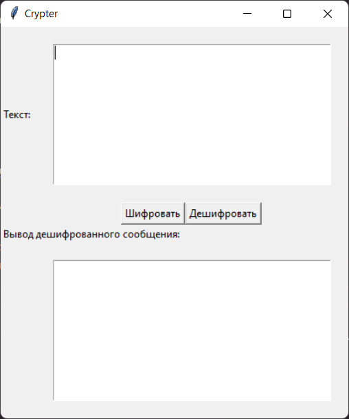

# Crypter
 > Программа разработанная специального для индивидуального проекта по теме 
 > 
 > `Криптография и защита информации`

### Алгоритм работы с программой:
  >1) Ввести шифруемый текст
  >
  >2) Нажать кнопку зашифровать
  >
  >3) Открыть папку ./Зашифрованные и открыть последний файл
  >
  >4) Для дешифрования вставить шифрованный (на английской раскладке) текст и нажать кнопку дешифровать
 
### Необходимые пакеты программ:
  >Для работы необходим [Python 3.9](https://www.python.org/ftp/python/3.9.11/python-3.9.11-amd64.exe)
  >
  >Установить необходимые библиотеки выполнив команду `pip install -r .\requirements.txt` в директории проекта
  

  
